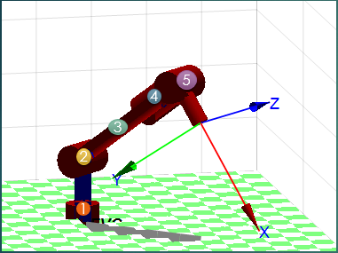

     
    This is a Robotics project on the fundamentals of kinematics. 

    We choosed 5 degrees of freedom Robot for welding aplications.
    
    

    The project contains the following subjects:
    Workspace and reachspace of the task
    Direct kinematics
    Inverse kinematic
    Generating the trajectories
    Simulation
     
    The detailed information of the project is on the  'explanaition'  power point presentation
    in the TF_Robotica1 file.
    And in case of not having matlab for runing the simulations 
    you can see them in the videos 'weldbot_circular_tubes.mp4' and  'weldbot_plane.mp4' also in the 
    TF_Robotica1 file.
    
    Hope u find it intresting and if u have any doubts dont hesitate to email me------> francogassibe@gmail.com
